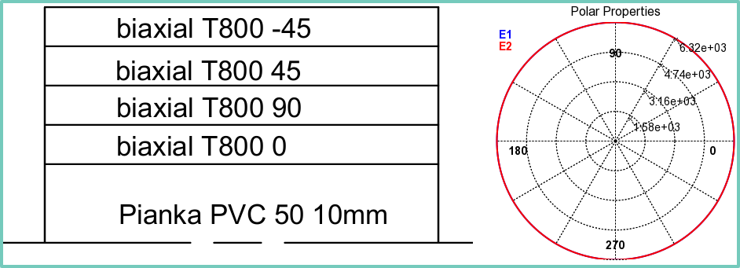
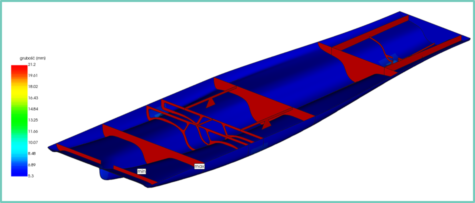
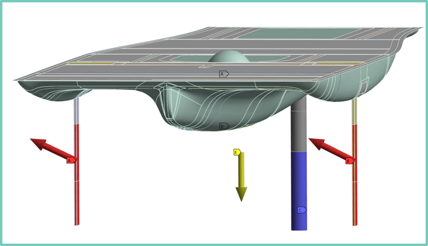
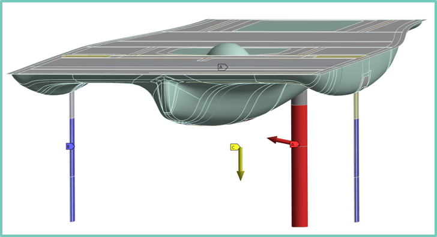
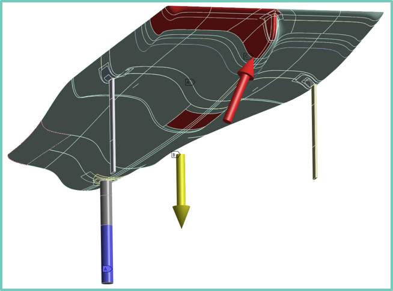
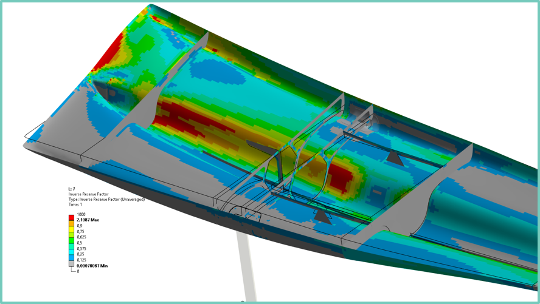
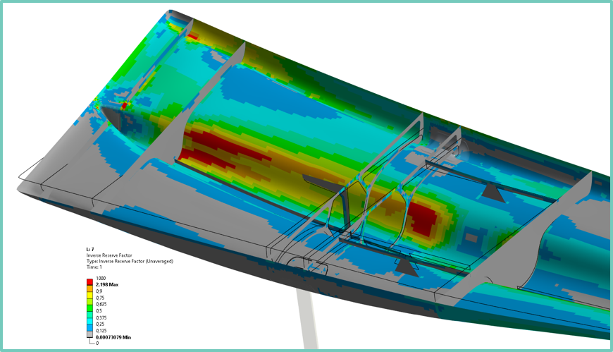

# Technical Report: Advanced Structural Analysis & Optimization of Composite Bulkheads

## 1. Project Overview & Interdisciplinary Integration
This project focuses on the structural design and numerical verification of the internal bulkhead system for the **"Delta" solar racing boat**. As a member of the **AGH Solar Boat Team**, I led the structural analysis division, working in close integration with the **CFD team**. 

The loading conditions used in this FEA model were derived directly from high-fidelity **Ansys Fluent CFD simulations**, ensuring that the structural response reflects actual hydrodynamic pressures and aerodynamic forces encountered during racing.

## 2. Methodology: High-Fidelity Composite Modeling (Ansys ACP)
To achieve a reliable virtual twin of the carbon fiber structure, I implemented an advanced workflow in **Ansys Composite PrepPost (ACP)**. This approach allowed for a precise ply-by-ply representation of the sandwich laminate.

### Material Characterization
The structure utilized a high-performance sandwich configuration:
* **Skins**: Biaxial Carbon Fiber T800 (150 gsm) with orthotropic properties ($E_1 = E_2 \approx 163\text{ GPa}$, $E_3 \approx 9.7\text{ GPa} $).
* **Core**: Cascell 50 RS PVC Foam (10 mm), optimized for shear transfer between skins.

The Laminate model for the bulkheads was created as a symmetrical stackup of materials layered on top of each other.

*Figure 1: Visualization of fiber symmetrical stackup of materials layered.*

### Advanced ACP Workflow Details
* **Geometry Partitioning**: The hull and bulkheads were meticulously sliced into numerous individual faces to allow for local layup variations and precise fiber mapping.
* **Rosettes & OSS**: I defined local coordinate systems (Rosettes) and Oriented Selection Sets (OSS) to control the fiber orientation ($0^\circ, 90^\circ, \pm45^\circ$) across the complex, double-curved surfaces of the hull.
* **Modeling Groups**: Organized the laminate into 5 main groups (P1-P5 Modeling Plies), enabling independent tracking of stress and failure for each bulkhead.

*Figure 2: Visualization shell thickness map of numerical model (Bulkheads: 21.2 mm vs. Hull: 5.3 mm).*

---

## 3. Real-World Load Scenarios & Numerical Techniques
To capture the boat's behavior without artificial stiffness from rigid constraints, I utilized the **Inertia Relief** method for all dynamic scenarios.

### Scenario 1: Sudden Sharp Turn (Interdisciplinary Load Case)
Based on CFD assumptions, a maneuver at $12\text{ m/s}$ with a 5-degree rotation was analyzed.
* **Variant A**: Resultant load of **$2235\text{ N}$** and **$2143.9\text{ N}$** on front pylons.
* **Variant B**: Resultant load of **$2148\text{ N}$** on the rear pylon.

*Figure 3: Boundary conditions and resultant force vectors derived from CFD data for Sudden Sharp Turn variant A.*

*Figure 4: Boundary conditions and resultant force vectors derived from CFD data for Sudden Sharp Turn variant B.*

### Scenario 2: Dynamic Slamming (Water Impact)
Simulating a drop from height, where a pressure of **$40\text{ kPa}$** acts on a $0.58\text{ m}^2$ surface area of the hull.

*Figure 5: Boundary conditions for Dynamic Slamming.*

---

# 4. Iterative Design Process 

### Failure Criteria & Manufacturing Link
The models were analyzed based on selected composite strength theories, which are grounded in engineering applications and established literature:
* Maximum Stress Criterion – compares stress components in the material directions ($\sigma_1$, $\sigma_2$, $\tau_{12}$) with their corresponding allowable limits. It is suitable for rapid, general safety assessments.
* **Core Failure**: Verified the foam core against shear crimping and failure.

The project followed an iterative path, where each simulation result drove geometric and laminate changes.

### Iteration 1: Initial Assessment
The first model utilized a uniform layup across the bulkheads. Results showed significant stress concentrations and an **Inverse Reserve Factor (IRF) exceeding 2.1**, indicating high failure risk in the central bulkhead region.

*Figure 6: Iteration 1 IRF map.*

### Iteration 2: Geometric Refinement
In response to the failure zones, the geometry of the bulkheads was modified and 3 of them were new, and the stacking sequence was adjusted in Ansys ACP. While the overall stiffness improved, new stress concentrations appeared near the hoisting points due to the changed load paths.

*Figure 7: Iteration 2 IRF results following geometric modifications.*

### Iteration 3: Final Design & Strategic Trade-offs
In the final iteration, the bulkhead position was adjusted, and a small cantilever bulkhead was added in front of the helmsman.

**The Engineering Decision**: Instead of introducing heavy additional bulkheads or another global carbon ply (which would compromise the boat's energy efficiency), the simulation phase was concluded with a pragmatic manufacturing plan. These coordinates were flagged for **local manual reinforcement** (carbon patches) during the vacuum bagging process.

*Figure 8: Final Iteration 3 results identifying zones for local production reinforcement.*

The final optimized design served as the **Layup Schedule** for the production team, ensuring that the physical lamination process accurately reflected the validated numerical model.

---

## 5. Conclusion & Final Validation
The structural analysis of the "Delta" solar boat bulkheads successfully integrated interdisciplinary data from **Ansys Fluent CFD** into a high-fidelity **Ansys ACP** model. By employing the **Inertia Relief** method, the simulation accurately captured the boat's response to extreme maneuvers and impacts without the risks of over-constraining the model.

The iterative design process (Iterations 1-3) allowed for a precise optimization of the laminate. The strategic decision to finalize the simulation with a localized Inverse Reserve Factor slightly above 1.0 — and addressing it through **targeted manual reinforcements** instead of global thickening — proved to be the correct engineering trade-off. This approach maximized the boat's performance-to-weight ratio, which was a decisive factor during international regattas.

The success of this "design-to-manufacture" cycle was confirmed by the flawless performance of the hull throughout the entire racing season, validating both the numerical assumptions and the production quality.

*Figure 9: Physical implementation of the optimized design - composite bulkheads during the final assembly stage with our AGH Solar Boat Team.*

