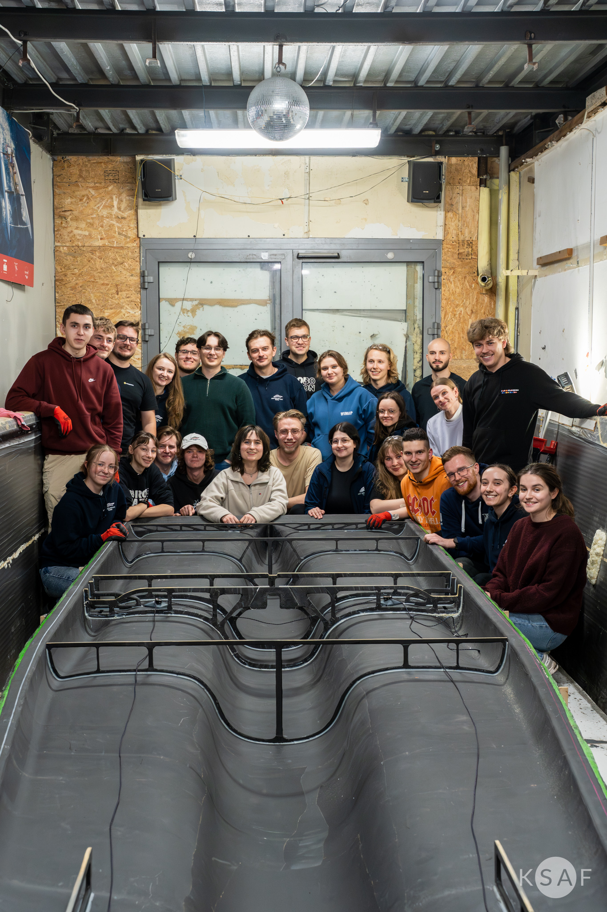

# Composite Structural Analysis — AGH Solar Boat Team

## Overview
This project presents the structural design, numerical analysis, and optimization of composite bulkheads for the **"Delta"** solar racing boat. As a member of the **AGH Solar Boat Team** (Construction Section), I managed the complete engineering cycle: from interdisciplinary load definition (integrating **Ansys Fluent CFD** data) and advanced laminate modeling in **Ansys ACP**, to final manufacturing validation.

### Verification & Validation:
The design was verified through a three-stage iterative optimization process against peak operational loads:
* **Interdisciplinary Integration**: Loading conditions were derived directly from high-fidelity **Ansys Fluent CFD** simulations.
* **Advanced Numerical Techniques**: Implemented the **Inertia Relief** method to capture the structural response in an unconstrained dynamic state (hoisting/slamming) without artificial constraint stiffness.
* **Real-world Success**: The optimized structure survived multiple international regatta seasons, validating the numerical assumptions and production quality.

## Engineering Details
* **Organization**: AGH Solar Boat Team (Section: Construction).
* **Software**: Ansys ACP (Composite PrepPost), Ansys Mechanical, Ansys Fluent, SolidWorks.
* **Materials**: CFRP sandwich structure — Biaxial Carbon Fiber T800 (150 gsm) + Cascell 50 RS PVC Foam core.
* **ACP Workflow**: Precise ply-by-ply modeling using **Rosettes**, **Oriented Selection Sets (OSS)**, and **Modeling Groups** for fiber orientation control ($0^\circ, 90^\circ, \pm45^\circ$).

## Key Results
* **Optimal Safety**: Successfully identified and resolved high-risk zones (initial **IRF > 2.1**) through geometric refinement and laminate adjustment.
* **Strategic Trade-off**: Optimized the performance-to-weight ratio by addressing localized failure risks (IRF slightly above 1.0) with **targeted manual reinforcements** instead of adding global weight.
* **Design-to-Manufacture**: The simulation results served as the final **Layup Schedule** for the vacuum bagging production process, ensuring the physical boat matched the validated numerical model.

 
*Figure 1: Physical implementation of the optimized design — composite bulkheads installed in the "Delta" hull with the AGH Solar Boat Team.*

## Project Structure
* `Composite_Bulkhead_Analysis.md` – Detailed technical report covering the iterative optimization and ACP workflow.
* `Modelowanie i symulacja kompozytów w Ansys ACP.pdf` – **Technical Workflow Guide**: Comprehensive breakdown of composite modeling techniques.
* `analiza strukturalna grodzi kompozytowych w łodzi Delta.pdf` – **Project Case Study**: Full structural report including load scenarios and manufacturing results.
