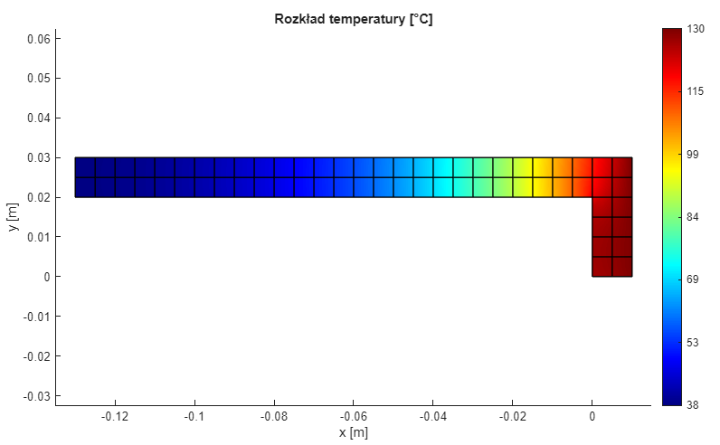

# Steady-State Thermal Solver (9-Node FEM)

## Overview
Custom-built 2D Finite Element Method (FEM) solver developed in MATLAB to optimize radiator geometry. The goal was to find the optimal arm length ($L$) to maintain temperature below 40°C.

### Verification:
Verified against **Ansys Steady-State Thermal** with a relative error of only **0.008%**.

## Engineering Details
* **Element Type:** High-order 9-node quadrilateral elements (Quadratic Lagrange).
* **Physics:** Steady-state heat conduction with convection (Robin boundary conditions).
* **Optimization:** Parametric study of arm length $L$ vs. tip temperature $T_B$.
* **Final Result:** Determined $L = 13\text{ cm}$ as the optimal design to meet $T_B \le 40^\circ C$ constraint.

## Key Results
| Parameter | Custom Solver | Ansys Reference | Error |
| :--- | :--- | :--- | :--- |
| **Avg Temp at B** | 38.062°C | 38.065°C | **0.008%** |

 

*Figure 1: Final temperature distribution for the optimized geometry.*

## Project Structure
* `thermal_2D.m` – Main solver script.
* `thermal_solver_study.md` – Technical breakdown (exported from Live Editor).
* `Technical_Report.pdf` – Full technical documentation.
