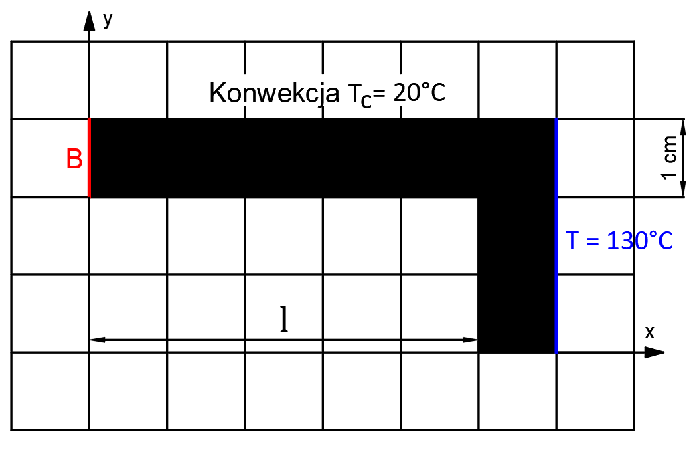
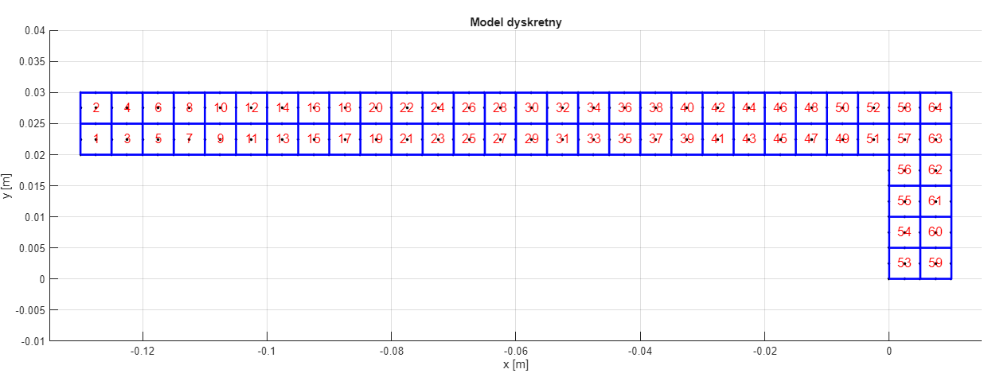
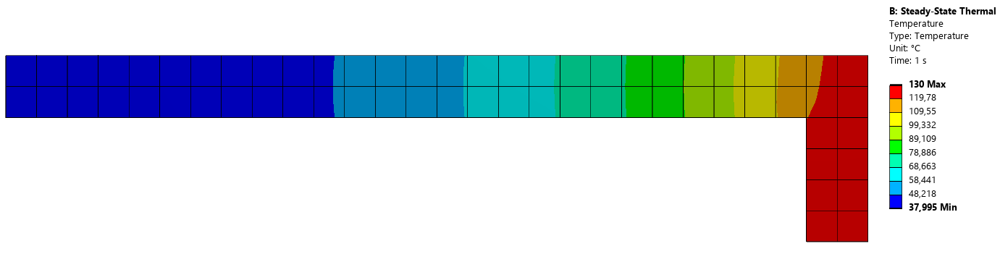

# 2D Finite Element Analysis: Steady\-State Thermal Conduction
# 1. Problem Definition & Objectives

This project implements a custom **Finite Element Method (FEM)** solver to analyze steady\-state heat distribution in an L\-shaped thermal conductor (radiator). The primary engineering goal is to find the required arm length $L$ such that the average temperature at the free end (Edge B) does not exceed $40^{\circ } \textrm{C}$ .


**Key Parameters**:


\* **Constant Temperature (Dirichlet BC)**: $130^{\circ } \textrm{C}$ on the right edge.


\* **Convection (Robin BC)**: Ambient temperature $T_c =20^{\circ } \textrm{C}$ and heat transfer coefficient $h=85{\;\textrm{W/(m}}^2 \cdot \textrm{K)}$ .


\* Conductivity ( $k_x ,k_y$ ): $55\;\textrm{W/(m}\cdot \textrm{K)}$ .





\*Figure 1: Analyzed domain and boundary conditions.\*

# 2. Mathematical Formulation

The solver utilizes **9\-node quadrilateral elements** with quadratic shape functions to ensure high accuracy. 

## Symbolic Shape Functions

The shape functions \$N(s,t)\$ are derived symbolically using a polynomial base:


 $P(s,t)=[1,s,t,st,s^2 ,t^2 ,s^2 t,st^2 ,s^2 t^2 ]$ .

# Symbolic Calculations
```matlab
%% Obliczenia symboliczne 
syms s t a b real
syms kx ky h Tc real

A_mat = [ 
     1 -a -b  a*b  a^2 b^2 -a^2*b -a*b^2 a^2*b^2; 
     1  0 -b    0    0 b^2      0      0       0; 
     1  a -b -a*b  a^2 b^2 -a^2*b  a*b^2 a^2*b^2; 
     1  a  0    0  a^2   0      0      0       0; 
     1  a  b  a*b  a^2 b^2  a^2*b  a*b^2 a^2*b^2; 
     1  0  b    0    0 b^2      0      0       0; 
     1 -a  b -a*b  a^2 b^2  a^2*b -a*b^2 a^2*b^2; 
     1 -a  0    0  a^2   0      0      0       0; 
     1  0  0    0    0   0      0      0       0  
];
% (Baza wielomianowa 1, s, t, st, s^2, t^2...)
base = [1, s, t, s*t, s^2, t^2, s^2*t, s*t^2, s^2*t^2];
N = base * inv(A_mat); 

% Pochodne funkcji kształtu
% Macierz gradientu 
Bs = diff(N, s); 
Bt = diff(N, t); 
B = [Bs; Bt];    
% Macierz przewodności 
C = [kx 0; 0 ky];

% Całka sztywności elementu
K_sym = int(int(B' * C * B, s, -a, a), t, -b, b);

% Całki dla konwekcji (Warunki brzegowe)
% Wzór: alpha = -h, beta = h*Tc
alpha = -h; 
beta  = h * Tc;

% Dolna krawędź (t = -b)
N_dol = subs(N, t, -b);
Ka_dol_sym = -int(alpha * (N_dol' * N_dol), s, -a, a);
Rb_dol_sym = int(beta * N_dol', s, -a, a);

% Górna krawędź (t = b)
N_gora = subs(N, t, b);
Ka_gora_sym = -int(alpha * (N_gora' * N_gora), s, -a, a);
Rb_gora_sym = int(beta * N_gora', s, -a, a);

% Lewa krawędź (s = -a)
N_lewa = subs(N, s, -a);
Ka_lewa_sym = -int(alpha * (N_lewa' * N_lewa), t, -b, b);
Rb_lewa_sym = int(beta * N_lewa', t, -b, b);
```
# Numerical Calculations
```matlab

%% Obliczenia numeryczne
%DANE LICZBOWE
kx_val = 55;   
ky_val = 55;
h_val  = 85;   
Tc_val = 20;   

% Geometria
L_ramie = 0.13;    
Grubosc = 0.01;    
H_calosc = 0.03;   

% Parametry dyskretyzacji 
dx = 0.005; 
dy = 0.005;
a_val = dx/2; 
b_val = dy/2;

% parametry 
K_temp = subs(K_sym, a, a_val);
K_temp = subs(K_temp, b, b_val);
% parametry materiałowe
K_temp = subs(K_temp, kx, kx_val);
K_temp = subs(K_temp, ky, ky_val);
K_el_num = double(K_temp);

% Podstawianie do macierzy brzegowych
% Dół
Ka_temp = subs(Ka_dol_sym, a, a_val); Ka_temp = subs(Ka_temp, h, h_val);
Ka_d_num = double(Ka_temp);
Rb_temp = subs(Rb_dol_sym, a, a_val); Rb_temp = subs(Rb_temp, h, h_val); Rb_temp = subs(Rb_temp, Tc, Tc_val);
Rb_d_num = double(Rb_temp);

% Góra
Ka_temp = subs(Ka_gora_sym, a, a_val); Ka_temp = subs(Ka_temp, h, h_val);
Ka_g_num = double(Ka_temp);
Rb_temp = subs(Rb_gora_sym, a, a_val); Rb_temp = subs(Rb_temp, h, h_val); Rb_temp = subs(Rb_temp, Tc, Tc_val);
Rb_g_num = double(Rb_temp);

% Lewa
Ka_temp = subs(Ka_lewa_sym, b, b_val); Ka_temp = subs(Ka_temp, h, h_val);
Ka_l_num = double(Ka_temp);
Rb_temp = subs(Rb_lewa_sym, b, b_val); Rb_temp = subs(Rb_temp, h, h_val); Rb_temp = subs(Rb_temp, Tc, Tc_val);
Rb_l_num = double(Rb_temp);
```
# 3. Discretization & Mesh Convergence

A mesh convergence study was performed to ensure the solution's accuracy. The average temperature at Edge B was evaluated for different element sizes.  

|      |      |      |      |      |
| :-- | :-- | :-- | :-- | :-- |
| **Iteration** <br>  | **Elements** <br>  | **Size \[m\]** <br>  | **Temp at B \[∘C\]** <br>  | **Relative Error \[%\]** <br>   |
| 1 <br>  | 8 <br>  | 0.01 <br>  | 86.46 <br>  | \- <br>   |
| 2 <br>  | 32 <br>  | 0.005 <br>  | 86.428 <br>  | 0.037% <br>   |
| 3 <br>  | 128 <br>  | 0.0025 <br>  | 86.42 <br>  | 0.009% <br>   |
|      |      |      |      |       |


**Final Configuration:** An element size of $0.005\textrm{m}$ (64 elements and 325 nodes for $L=13\textrm{cm}$ ) was chosen for the final simulation.




```matlab
%% Dyskretyzacja 
% A. Generowanie WĘZŁÓW 
nodes_x = [];
nodes_y = [];
licznik_wezlow = 0;

% Zakresy pętli dla węzłów 
x_start = -L_ramie;
x_end = Grubosc;
y_start = 0;
y_end = H_calosc;

step_x_node = dx/2;
step_y_node = dy/2;

% Margines błędu 
TOL = 1e-6; 

for cx = x_start : step_x_node : (x_end + TOL)
    for cy = y_start : step_y_node : (y_end + TOL)
        
        % Weryfikacja czy znajudje się w zakresie "L"
        w_pionie = (cx >= -TOL && cx <= Grubosc + TOL) && ...
                   (cy >= -TOL && cy <= H_calosc + TOL);
                   
        w_poziomie = (cx >= -L_ramie - TOL && cx <= TOL) && ...
                     (cy >= H_calosc - Grubosc - TOL && cy <= H_calosc + TOL);
        
        if w_pionie || w_poziomie
            licznik_wezlow = licznik_wezlow + 1;
            nodes_x(licznik_wezlow, 1) = cx;
            nodes_y(licznik_wezlow, 1) = cy;
        end
    end
end
num_nodes = licznik_wezlow;

% B. Generowanie elementów
ELEMS = [];
licznik_elementow = 0;

for ex = x_start : dx : (x_end - dx + TOL)
    for ey = y_start : dy : (y_end - dy + TOL)
        
        % Jeśli środek jest wewnątrz "L", to tworzy element
        xc = ex + dx/2; 
        yc = ey + dy/2;
        
        srodek_pion   = (xc >= 0 && xc <= Grubosc) && (yc >= 0 && yc <= H_calosc);
        srodek_poziom = (xc >= -L_ramie && xc <= 0) && (yc >= H_calosc - Grubosc && yc <= H_calosc);
        
        if srodek_pion || srodek_poziom
            % Szukanie ID elementu
            szukane_x = [ex,     ex+dx/2, ex+dx, ex+dx,   ex+dx,   ex+dx/2, ex,      ex,      ex+dx/2];
            szukane_y = [ey,     ey,      ey,    ey+dy/2, ey+dy,   ey+dy,   ey+dy,   ey+dy/2, ey+dy/2];
            
            ids_elementu = zeros(1,9);
            komplet = 1;
            
            for k = 1:9
                id_wezla = 0;
                % Przeszukujemy listę wszystkich węzłów
                for n = 1:num_nodes
                    if abs(nodes_x(n) - szukane_x(k)) < TOL && abs(nodes_y(n) - szukane_y(k)) < TOL
                        id_wezla = n;
                    end
                end
                
                if id_wezla > 0
                    ids_elementu(k) = id_wezla;
                end
            end
            
            if komplet
                licznik_elementow = licznik_elementow + 1;
                ELEMS(licznik_elementow, :) = ids_elementu;
            end
        end
    end
end
num_elems = size(ELEMS, 1);
% wypis parametów modelu dyskretnego
fprintf('Parametów modelu dyskretnego:\n');
fprintf('  Węzłów: %d\n', num_nodes);
fprintf('  Elementów: %d\n', num_elems);

%% Wizualizacja modelu dyskretnego 
figure(1); hold on; axis equal; grid on;
title('Model dyskretny');
xlabel('x [m]'); ylabel('y [m]');

plot(nodes_x, nodes_y, 'k.', 'MarkerSize', 8);

for e = 1:num_elems
    wezly = ELEMS(e, :);
    
    
    x_rys = []; y_rys = [];
    kolejnosc = [1, 2, 3, 4, 5, 6, 7, 8, 1];
    
    for k = 1:length(kolejnosc)
        id = wezly(kolejnosc(k));
        x_rys(k) = nodes_x(id);
        y_rys(k) = nodes_y(id);
    end
    plot(x_rys, y_rys, 'b-', 'LineWidth', 2);
    xlim([-0.135 0.015])
    ylim([-0.010 0.040])
    
    id_srodek = wezly(9);
    text(nodes_x(id_srodek), nodes_y(id_srodek), num2str(e), 'Color', 'r', 'FontSize', 12, 'HorizontalAlignment', 'center');
end
```
# 4. Assembly & Solver Implementation

The global stiffness matrix $K_{global}$ is assembled by aggregating element matrices. Dirichlet boundary conditions are enforced using the penalty method with a tolerance of $10^{15}$ . 

```matlab
%% Agregacja 
K_global = sparse(num_nodes, num_nodes);
F_global = zeros(num_nodes, 1);

for e = 1:num_elems
    nodes = ELEMS(e, :);
    
    % Macierz sztywności
    K_global(nodes, nodes) = K_global(nodes, nodes) + K_el_num;
    
    % Pobranie współrzędnych węzłów elementu
    ex = nodes_x(nodes);
    ey = nodes_y(nodes);
    
    % 1. Krawędź DOLNA (y = 0 lub y = H-grubosc pod ramieniem)
    min_y = min(ey);
    max_x = max(ex);
    
    jest_dol_ukladu = 0;
    if abs(min_y - 0) < TOL
        jest_dol_ukladu = 1;
    end
    
    jest_dol_ramienia = 0;
    if (abs(min_y - (H_calosc - Grubosc)) < TOL) && (max_x < TOL)
        jest_dol_ramienia = 1;
    end
    
    if jest_dol_ukladu == 1 || jest_dol_ramienia == 1
        K_global(nodes, nodes) = K_global(nodes, nodes) + Ka_d_num;
        F_global(nodes) = F_global(nodes) + Rb_d_num;
    end
    
    % 2. Krawędź GÓRNA (y = H_calosc)
    max_y = max(ey);
    if abs(max_y - H_calosc) < TOL
        K_global(nodes, nodes) = K_global(nodes, nodes) + Ka_g_num;
        F_global(nodes) = F_global(nodes) + Rb_g_num;
    end
    
    % 3. Krawędź LEWA (x = -L lub x = 0 pod ramieniem)
    min_x = min(ex);
    
    jest_lewa_koniec = 0;
    if abs(min_x - (-L_ramie)) < TOL
        jest_lewa_koniec = 1;
    end
    
    jest_lewa_wewn = 0;
    if (abs(min_x - 0) < TOL) && (max_y < H_calosc - Grubosc)
        jest_lewa_wewn = 1;
    end
    
    if jest_lewa_koniec == 1 || jest_lewa_wewn == 1
        K_global(nodes, nodes) = K_global(nodes, nodes) + Ka_l_num;
        F_global(nodes) = F_global(nodes) + Rb_l_num;
    end
end

%% Warunek Dirichleta (T=130)

nodes_dirichlet = [];
licznik_dir = 0;

for i = 1:num_nodes
    if abs(nodes_x(i) - Grubosc) < TOL
        licznik_dir = licznik_dir + 1;
        nodes_dirichlet(licznik_dir) = i;
    end
end

tolerance_dirichlet = 1e15;
T_wb = 130;

for k = 1:length(nodes_dirichlet)
    id = nodes_dirichlet(k);
    K_global(id, id) = tolerance_dirichlet;
    F_global(id) = tolerance_dirichlet * T_wb;
end
```
# 5. Results & Visualization

For the final design length of $13\textrm{cm}$ , the radiator successfully meets the objective:  

-  **Max Temperature:** $130.00^{\circ } \textrm{C}$ .   
-  **Min Temperature:** $38.03^{\circ } \textrm{C}$ .   
-  **Average at Edge B:** $38.06^{\circ } \textrm{C}$ .   


Figure 3: Steady\-state temperature distribution

```matlab
%% Rozwiązanie i wyniki
T = K_global \ F_global;

disp(['Temperatura Maksymalna: ', num2str(max(T))]);
disp(['Temperatura Minimalna: ', num2str(min(T))]);

% Obliczanie średniej na końcu B
suma_temp_B = 0;
licznik_B = 0;
for i = 1:num_nodes
    if abs(nodes_x(i) - (-L_ramie)) < TOL
        suma_temp_B = suma_temp_B + T(i);
        licznik_B = licznik_B + 1;
    end
end
srednia_B = suma_temp_B / licznik_B;
disp(['Srednia temp. na koncu B: ', num2str(srednia_B)]);

%% 8. WYKRES TEMPERATURY (PATCH)
figure(2);
title('Rozkład temperatury [°C]');
xlabel('x [m]'); ylabel('y [m]');
axis equal; 
hold on;

% Rysowanie po subelementach (tylko wizualizacyjnie)
% Każdy element 9-węzłowy dzielimy na 4 mniejsze czworokąty
for e = 1:num_elems
    wezly = ELEMS(e, :);
 
    ids_1 = wezly([1, 2, 9, 8]);
    patch(nodes_x(ids_1), nodes_y(ids_1), T(ids_1), 'EdgeColor', 'none', 'FaceColor', 'interp');
    
    ids_2 = wezly([2, 3, 4, 9]);
    patch(nodes_x(ids_2), nodes_y(ids_2), T(ids_2), 'EdgeColor', 'none', 'FaceColor', 'interp');
    
    ids_3 = wezly([9, 4, 5, 6]);
    patch(nodes_x(ids_3), nodes_y(ids_3), T(ids_3), 'EdgeColor', 'none', 'FaceColor', 'interp');
    
    ids_4 = wezly([8, 9, 6, 7]);
    patch(nodes_x(ids_4), nodes_y(ids_4), T(ids_4), 'EdgeColor', 'none', 'FaceColor', 'interp');
end

cb = colorbar;
cb.Ticks = linspace(min(T), max(T), 7);  
cb.TickLabels = compose('%.0f', cb.Ticks);
colormap jet;
xlim([-L_ramie - 0.005, Grubosc + 0.005]);

% Obrys
for e = 1:num_elems
    wezly = ELEMS(e, :);
    kolejnosc = [1, 2, 3, 4, 5, 6, 7, 8, 1];
    plot(nodes_x(wezly(kolejnosc)), nodes_y(wezly(kolejnosc)), 'k-', 'LineWidth', 0.5);
end
toc 
```
# 6. Validation: MATLAB vs. Ansys

To verify the custom solver, the results were compared against professional **Ansys Steady\-State Thermal** software.  

-  **MATLAB Solver (9\-node):** $38.062^{\circ } \textrm{C}$ .   
-  **Ansys (8\-node):** $38.065^{\circ } \textrm{C}$ .   
-  **Relative Error:** $0.008\%$ .   

The negligible difference confirms that the manual FEM implementation accurately represents the physical phenomenon.  





Figure 4: Temperature distribution comparison from Ansys. 

