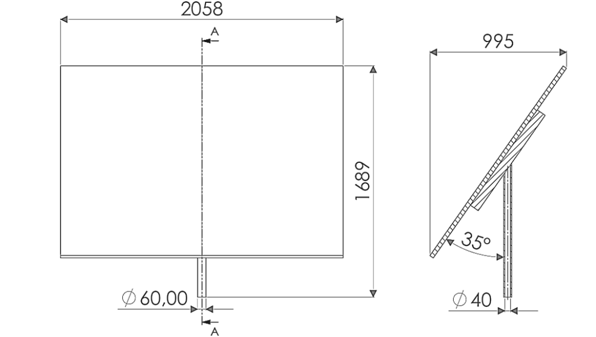
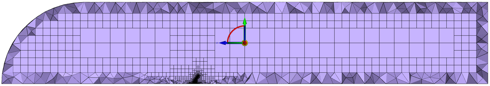
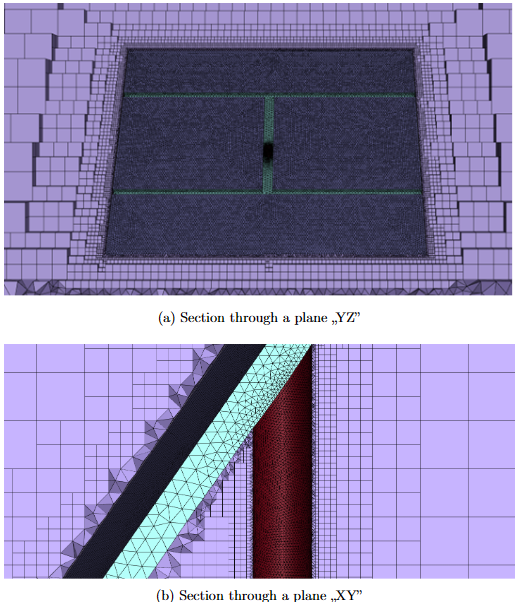
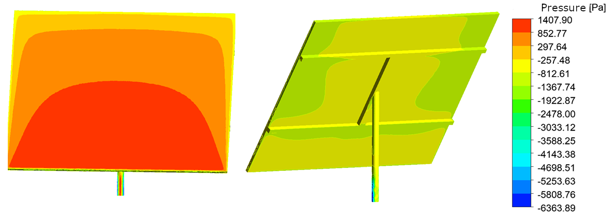
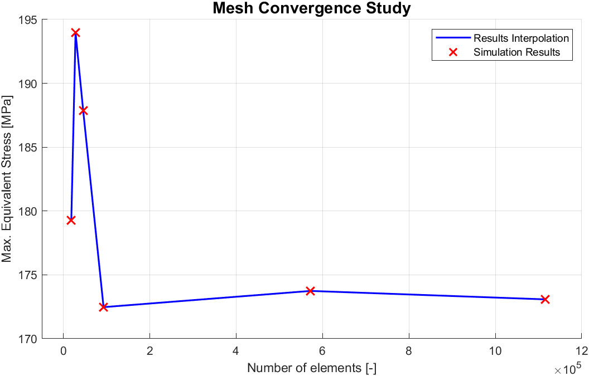

# Technical Report: FSI Analysis of a Ground-Mounted PV Rack

## 1. Problem Definition & Objectives
This project analyzes the structural response of a ground-mounted photovoltaic (PV) system to extreme atmospheric conditions. The primary engineering goal is to verify if the structure remains within the elastic range and maintains sufficient stiffness during peak wind gusts.

**Key Parameters**:
* **Wind Velocity ($v$):** $47\text{ m/s}$ (peak gusts recorded in Poland).
* **Structure Angle ($\alpha$):** $35^\circ$ tilt.
* **Analysis Type:** One-way Fluid-Structure Interaction (FSI).

*Figure 1: Simplified 3D model and main dimensions.*

---

## 2. Methodology & Numerical Domain

### CAD Geometry & Simplification
To ensure mesh quality and computational efficiency, the industrial model was simplified in **SolidWorks**:
* The support frame was standardized into an "H-type" structure.
* Small connectors and bolts were omitted; the model was treated as a consolidated multi-body part.
* Supporting post was changed to a square profile for better boundary layer mesh resolution.

### Fluid Domain (CFD)
A semi-spherical domain was designed to allow for various wind attack angles.
* **Model**: SST $k-\omega$ turbulence model for accurate flow separation prediction.
* **Boundary Conditions**: $47\text{ m/s}$ inlet velocity at the spherical boundary.
* **Mesh**: **Mosaic Meshing** with Hexcore technology to resolve gradients around the structure.

*Figure 2: Representation of the computational domain using the Mosaic Mesh algorithm in a cross-section relative to the YZ plane.*

*Figure 2: Computational domain and hybrid mesh refinement.*

---

## 3. CFD Results: Aerodynamic Loading
The CFD simulation provided the pressure field required for structural analysis.
* **Peak Static Pressure**: $1407.90\text{ Pa}$ located at the lower panel edge and front of the post.
* **Suction Zone**: Significant negative pressure of $-6363.89\text{ Pa}$ on post sides due to vortex shedding.

*Figure 3: Aerodynamic pressure distribution (windward and leeward).*

---

## 4. FEA Results: Structural Response
Pressure loads were mapped onto the structural mesh in ANSYS Mechanical.
* **Material**: Structural Steel ($R_e = 250\text{ MPa}$, $E = 2 \cdot 10^5\text{ MPa}$).
* **Max Stress (HMH)**: $205.68\text{ MPa}$ at the base of the pillar.
* **Max Displacement**: $17.04\text{ mm}$ in the X-axis, ensuring operational safety.

*Figure 4: HMH stress concentration at the pillar base.*

---

## 5. Verification: Convergence Study
To ensure numerical stability, convergence tests were performed for both solvers. Mesh independence was achieved when the relative change in peak stress dropped below $1\%$.

*Figure 5: Stress convergence as a function of element count.*

---

## 6. Conclusion
The FSI workflow confirmed the design's integrity. Under $47\text{ m/s}$ loads, the safety factor is **1.25** against material yield. The displacement is well within limits, proving the structure's rigidity and functional safety.
