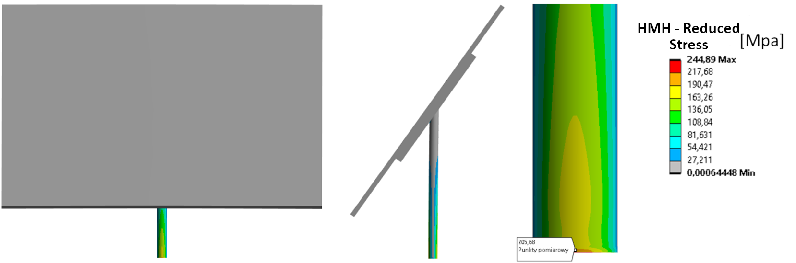

# Strength Analysis of PV Structure (One-Way FSI)

## Overview
Numerical strength analysis of a ground-mounted photovoltaic (PV) structure subjected to extreme wind loads ($47 \text{ m/s}$). The project utilizes **Fluid-Structure Interaction (FSI)** to accurately map aerodynamic pressures from a CFD simulation onto the structural frame to verify its safety factor and stiffness.

### Verification:
The model was verified through rigorous **mesh convergence tests** for both domains:
* **CFD Domain:** Stability achieved at $\approx 1.05 \text{ million}$ cells with $< 1\%$ variation in peak pressure.
* **Structural Domain:** Convergence reached at $\approx 93,000$ elements with $< 1\%$ stress variation.

## Engineering Details
* **Simulation Type:** One-way coupled Fluid-Structure Interaction (FSI).
* **CFD Setup:** RANS equations with the **SST $k-\omega$** turbulence model to capture flow separation.
* **Structural Setup:** Linear static analysis using the **Huber-Mises-Hencky (HMH)** hypothesis.
* **Tools:** SolidWorks (CAD), ANSYS Fluent (CFD), ANSYS Mechanical (FEA).
* **Meshing:** Hybrid Mosaic Hexcore for the fluid domain and high-order (2nd order) Hex/Tetra elements for the structure.

## Key Results
Analysis confirmed the structure remains in the elastic range under design loads.

| Parameter | Result | Limit | 
| :--- | :--- | :--- |
| **Max Pressure (CFD)** | $1407.90 \text{ Pa}$ | N/A | 
| **Max HMH Stress** | $205.68 \text{ MPa}$ | 
| **Max Displacement** | $17.04 \text{ mm}$ | 

 
*Figure 1: HMH stress distribution under* $47 \text{ m/s}$ *wind load.*

## Project Structure
* `FSI_Solar_Technical_Report.md` – Detailed technical breakdown of the methodology.
* `Engineering_Thesis_Sypniewski.pdf` – Full technical documentation (Polish).
