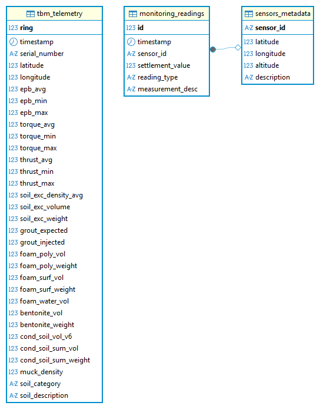
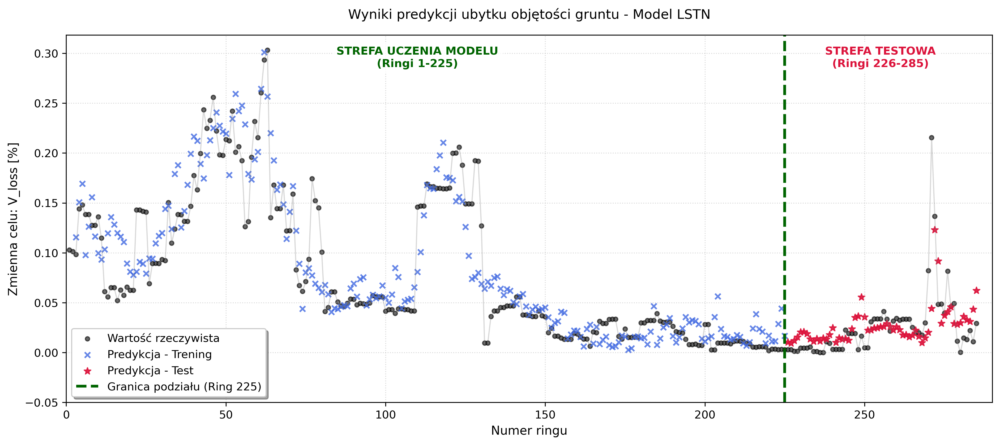

 # ML for TBM-Induced Ground Volume Loss Prediction

**Comparative Analysis of Machine Learning Architectures for Predicting Ground Volume Loss Induced by TBM Operation** — M.Sc. Thesis, AGH University of Krakow (Faculty of Mechanical Engineering and Robotics), 2026.
Author: Rafał Sypniewski · Supervisor: prof. dr hab. inż. Krzysztof Tajduś

## Overview
Tunnel Boring Machines (TBM) generate massive volumes of real-time telemetry (thrust, torque, EPB chamber pressure, grouting/conditioning volumes), while their impact on the surface is only sparsely measured by discrete geodetic readings. This project builds a full **end-to-end ML pipeline** that turns those two heterogeneous, noisy data sources into a benchmarked prediction of **$V_{loss}$ (ground volume loss)** — arguably the single most important engineering indicator of tunneling-induced surface deformation.

Instead of the commonly used maximum point settlement $s_{max}$ (highly sensitive to sensor noise and local anomalies), this work predicts the **spatially integrated volume loss per ring**, derived directly from discrete geodetic readings in a moving spatial window matched to the shield geometry.

## Key Technical Highlights
* **Real construction-site data:** 217 raw spreadsheet files (~1.5 GB) of geodetic monitoring + TBM PLC telemetry, for a shield of diameter $D = 13.0$ m.
* **Relational data engineering:** PostgreSQL schema (`tbm_telemetry`, `monitoring_readings`, `sensors_metadata`) with full referential integrity, exported to columnar **Parquet** (324 MB → 6.48 MB).
* **Dynamic spatial window** ($-1.0D$ to $+1.5D$ longitudinal, $\pm2.5D$ transverse) to isolate short-term settlement directly attributable to the shield's current position.
* **Four independent methods** implemented and benchmarked to derive the $V_{loss}$ ground-truth target itself — not just to model it.
* **Four ML architectures** benchmarked chronologically (train = rings 1–225, test = rings 226–285): MLR baseline, Random Forest, XGBoost, LSTM.
* **Feature engineering:** Spearman-correlation-based collinearity removal, one-hot geological layer encoding, standardization — from 15 raw variables down to 14 final features (8 operational + 6 geological).

## Methodology

### 1. Data pipeline (ETL)
Raw geodetic sheets and TBM PLC exports → coordinate system unification (PL-2000 → WGS84) → PostgreSQL structuring → Parquet export. See `reports/ETL_raport_koordynaty.txt`, `reports/parquet_raport.txt`.


*Figure: Relational schema (ERD) of the PostgreSQL database — `tbm_telemetry`, `monitoring_readings`, `sensors_metadata`.*
<!-- TODO: swap in the actual ERD export if you want it here (Rys. 3.2 in the thesis) -->

### 2. Ground-truth estimation — 4 competing methods
$V_{loss}$ is not directly measured — it has to be reconstructed from sparse geodetic points. Four methods were implemented and statistically compared:

| Method | Description | Mean [%] | Std. dev. [%] |
|---|---|---|---|
| A — Peck curve fitting | Gaussian curve fit (`scipy.optimize.curve_fit`) | 0.642 | 0.921 |
| **B — Trapezoidal integration** ✅ | Direct numerical integration (`numpy.trapz`) of raw readings | 0.199 | **0.273** |
| C — Weighted statistical estimation | 95th-percentile $s_{max}$ + variance-weighted trough width | 0.541 | 0.988 |
| D — RBF interpolation | Multiquadric radial basis function surface | 0.239 | 0.313 |

**Method B (direct trapezoidal integration)** was selected as the final target-generation method for the lowest standard deviation — i.e. the best resistance to measurement noise propagating into the training target, at the cost of a slightly conservative (lower-bound) estimate.

### 3. Feature engineering
Spearman correlation analysis flagged `thrust_range` as critically correlated ($R > 0.85$) with `thrust_avg` → removed. Final feature space: 14 variables (8 TBM operational parameters + 6 one-hot geological layers, each above the 5% presence threshold).


*Figure: Spearman correlation matrix (upper triangle) for the TBM feature set.*

### 4. Model benchmark
Chronological split (no shuffling — this is a spatio-temporal process): **train = rings 1–225 (79%)**, **test = rings 226–285 (21%)**.

| Model | Train RMSE [%] | Train R² | Test RMSE [%] | Test R² |
|---|---|---|---|---|
| Linear Regression (MLR, baseline) | 0.041 | 0.677 | 0.035 | −0.040 |
| Random Forest (tuned) | 0.011 | 0.978 | 0.034 | 0.018 |
| XGBoost (tuned) | 0.005 | 0.994 | 0.032 | 0.099 |
| **LSTM** (best of 12 runs) | 0.032 | 0.797 | **0.029** | **0.272** |


*Figure: Chronological prediction response — LSTM vs. ground truth ($V_{loss}$), train/test split at ring 225.*
<!-- TODO: point this at whichever run (v1–v12) matches your final reported metrics if it's not v11 -->

## Key Results
* **MLR and Random Forest fail to generalize** — MLR collapses to $R^2 < 0$ on the test set; Random Forest overfits almost perfectly on training data ($R^2 = 0.978$) but drops to $R^2 = 0.018$ out-of-sample.
* **XGBoost's built-in L2 regularization** meaningfully improves generalization ($R^2 = 0.099$) without the Random Forest's overfitting collapse.
* **LSTM is the clear winner on the test set** ($R^2 = 0.272$, lowest RMSE at 0.029%) — the only architecture able to reproduce the sudden deformation spikes around rings 250 and 270, thanks to its 2-step time window capturing the *rate of change* of TBM parameters rather than their static value.
* **Honest caveat:** even the best model's test-set $RMAE \approx 68\%$ shows this is still far from production-ready — it's a genuine research result, not a finished predictive tool. See Chapter 5 of the thesis for the full discussion of limitations (temporal-resolution mismatch between 1 Hz telemetry and sparse geodetic readings, and the target variable itself being a numerically reconstructed quantity, not a direct measurement).

## Tech Stack
* **Language:** Python 3.10+
* **Data Science:** Scikit-learn, XGBoost, PyTorch, Pandas, NumPy, SciPy, Seaborn
* **Database:** PostgreSQL, Parquet
* **Hardware:** CUDA-enabled GPU (NVIDIA RTX 4090) for LSTM training

## Project Structure
```
   ML_TBM/
   ├── figures/   # Model prediction plots, correlation matrix, DB schema
   ├── reports/   # Generated text reports per pipeline stage
   └── scripts/   # (do przywrócenia) — ETL → geostatystyka → feature engineering → modele
```

## Limitations & Future Work
* Temporal resolution mismatch: TBM telemetry is logged at ~1 Hz, but geodetic settlement readings are sparse and discrete — richer, denser surface monitoring (automated total stations, fiber-optic sensors) would likely unlock better short-term dynamics modeling.
* The $V_{loss}$ target itself is a numerically reconstructed quantity (not a direct measurement), so its own estimation error propagates into every downstream model.
* Planned direction: enriching the feature space with continuous geotechnical parameters (deformation modulus, cohesion, friction angle) instead of categorical soil layers, and exploring hybrid architectures (CNN-LSTM, GNN) that combine spatial and sequential feature extraction.

---
Full methodology, literature review and mathematical derivations are documented in the thesis (`docs/thesis.pdf` — add it here if you want the repo to be self-contained).

